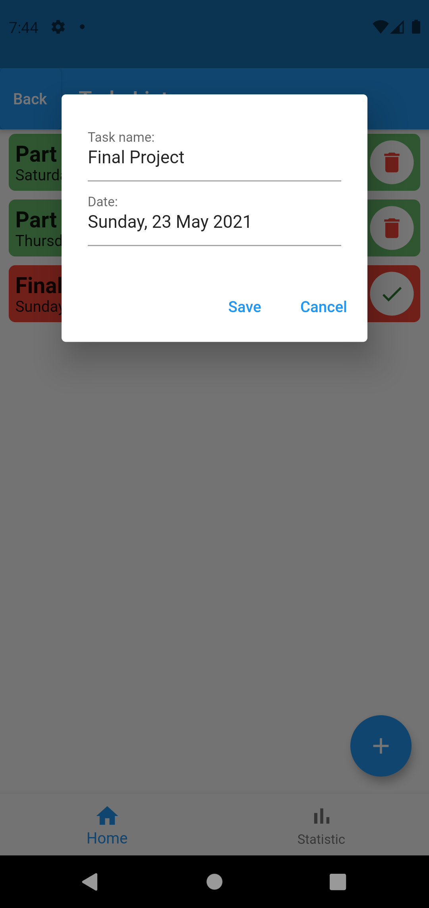

# Todo App using Flutter

Creating simple todo app using Flutter. List are stored in sqlite database using sqflite package.

Features:
* Mark a task as finished
* Edit an unfinished task
* Unmark a finished task
* Remove a finished task from list
* Number of finished and unfinished tasks

Screenshots:

  
  
  
  

